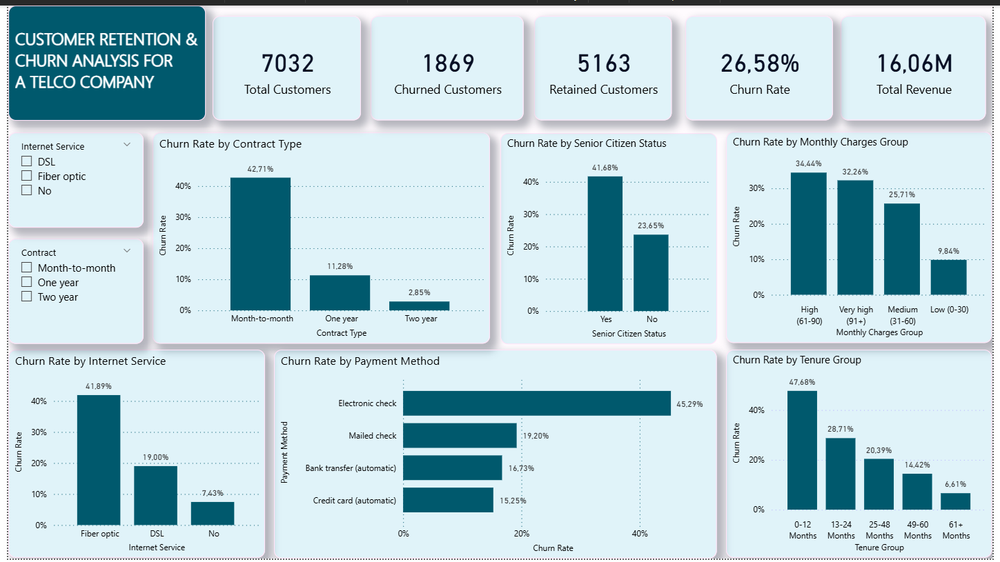

# TELCO CUSTOMER CHURN ANALYSIS
### Author: Prudence Tlou

## Project Overview
This project analyzes customer churn for a telecommunications company using real-world subscription data. The goal is to help business teams understand why customers leave, which segments are most at risk, and what actions can improve customer retention.
This type of analysis is core to SaaS, fintech, and subscription-based businesses where reducing churn directly improves revenue and growth.

## Business Questions Answered
- Why are customers leaving the platforn?
- Which customer segments are most likely to churn?
- How long do customers typically stay actively?
- What actions can improve customer retention?

## Dataset
- Source: IBM Telco Customer Churn Dataset
- Rows: 7032 customers
- Columns: 21 features including demographics, services, contract type, payment method and churn status

## Tools Used
| Tool | Purpose |
|----|---|
| MySQL | Data cleaning and Analysis |
| Power BI | Interactive dashboard and business storytelling |
| GitHub | Version control and portfolio sharing |
### Data Cleaning (SQL)
- Checked for and confirmed no duplicate records
- Checked for and confirmed no NULL values in key columns
- Added ChurnFlag column (1 = Churned, 0 = Retained) for calculations
- Added SeniorCitizenFlag column (Yes/No) to replace 0/1 values
- Added ChargesGroup column to group customers by monthly charges
- Added TenureGroup column to group customers by tenure length

## Analysis Sumarry
#### 1. Overall Churn Rate
   | Metric | Value |
   |---|---|
   | Total Customers | 7032 |
   | Churned Customers | 1869 |
   | Retained Customers | 5163 |
   | Churn Rate | 26.58% |
   | Retention Rate | 73.42% |
#### 2. Churn by Contract Type
   | Contract | Churn Rate |
   |---|---|
   | Month-to-month | 42.71% |
   | One year | 11.288% |
   | Two year | 2.85% |
#### 3. Churn by Internet Service
   | Internet Service | Churn Rate |
   |---|---|
   | Fiber Optic | 41.89% |
   | DSL | 19.00% |
   | No Internet | 7.43% |
#### 4. Churn by Payment Method
   | Payment Method | Churn Rate |
   |---|---|
   | Electronic Check | 45.29% |
   | Mailed Check | 19.20% |
   | Bank Transfer (Auto) | 17.73% |
   | Credit Card (Auto) | 15.25% |
#### 5. Churn by Senior Citien Status
   | Senior Citizen | Churn Rate |
   |---|---|
   | Yes | 41.68% |
   | No | 23.65% |
#### 6. Average Customer Tenure
   | Churn Status | Avg Tenure |
   |---|---|
   | Retained | 37.65 months |
   | Churned | 17.98 months |
#### 7. Churn by Tenure Group
   | Tenure Group | Churn Rate |
   |---|---|
   | 0-12 months | 47.68% |
   | 13-24 months | 28.71% |
   | 25-48 months | 20.39% |
   | 49-60 months | 14.42% |
   | 61+ months | 6.61% |
#### 8. Churn by Monthly Charges Group
   | Charges Group | Churn Rate |
   |---|---|
   | High ($61-$90) | 34.44% |
   | Very High ($91+) | 32.18%% |
   | Medium ($31-$60) | 25.97% |
   | Low ($0-$30) | 9.84% |
### Key Business Insights
1. **High churn rate** — At 26.58%, the company is losing more than 1 in 4 customers, which is above the telecom industry average
2. **Month-to-month contracts are the biggest risk** — 42.71% churn rate vs only 2.85% for two-year contracts
3. **Fiber Optic customers are unhappy** — Despite being the premium service, fiber optic has the highest churn at 41.89%, suggesting a value-for-money problem
4. **Electronic check customers churn the most** — Manual payment methods correlate strongly with higher churn
5. **Senior citizens need attention** — Churning at almost double the rate of non-seniors (41.68% vs 23.65%)
6. **First 12 months are critical** — Nearly 1 in 2 new customers leave within the first year
  
## Business Recommendations
1. Offer incentives to convert month-to-month customers to longer contracts
2. Investigate fiber optic service quality and review pricing strategy
3. Encourage automatic payments through discounts or rewards
4. Create dedicated senior citizen plans with simplified services and pricing
5. Improve onboarding experience for new customers in their first 12 months
6. Launch loyalty programs to reward long-term customers

## Dashboard Preview

